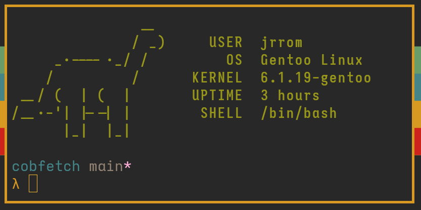

<h2 align="center"> cobfetch </h2>
<h4 align="center"> System info fetcher using COBOL! </h4>

</img>
A small system info fetcher for Linux systems using COBOL made for fun. Has dinosaur ASCII art since COBOL is a dinosaur language after all. Uses [cobweb-pipes](https://sourceforge.net/p/gnucobol/contrib/HEAD/tree/trunk/tools/cobweb/cobweb-pipes/).

**Requirements**
*  `/etc/os-release` file 
* GNUCobol
* runtime
* uname
* uptime
* A [compatible C standard library](https://en.wikipedia.org/wiki/C_POSIX_library)

 

**Thanks**
* [afetch](https://github.com/13-CF/afetch)
* Contributors to [cobweb-pipes](https://sourceforge.net/p/gnucobol/contrib/HEAD/tree/trunk/tools/cobweb/cobweb-pipes/)
* [https://www.asciiart.eu/](https://www.asciiart.eu/) for the ASCII dinosaur. I do not know the creator.